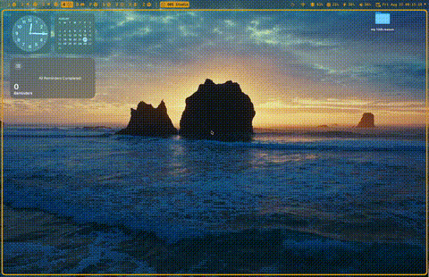

# Free Raycast Notes

A free, open-source alternative to Raycast Notes Pro built with Tauri and React. This application replicates the core functionality of Raycast Notes without the $4/month subscription cost.

[](https://github.com/willzeng274/raycast-notes-free) [](LICENSE) [](https://github.com/willzeng274/raycast-notes-free)

## Demo



## Features
 
### Core Functionality
- **Rich Text Editor**: Live markdown rendering with TipTap
- **Note Management**: Create, duplicate, delete, and pin notes
- **Auto-save**: Changes are automatically saved every second
- **Smart Titles**: Note titles are derived from the first H1 heading
- **Pinned Notes**: Keep important notes at the top of your list

### Keyboard Shortcuts
- `⌘ + K`: Open Command Palette
- `⌘ + P`: Browse/Search Notes
- `⌘ + N`: Create New Note
- `⌘ + D`: Duplicate Current Note
- `⌘ + W`: Hide Panel
- `⌘ + Q`: Quit Application

### Native macOS Integration
- **Frameless Window**: Custom rounded corners and transparency
- **Vibrancy Effect**: Semi-transparent background with backdrop blur
- **Custom Traffic Lights**: Native-looking window controls
- **Screen Sharing Support**: Hide/show window during screen sharing sessions
- **Global Hotkeys**: Works system-wide, not just within the app

### Command Palette Actions
- Show/Hide While Screen Sharing ✅
- Copy Note as Markdown (TODO)
- Copy Deeplink (TODO)
- Export Notes (TODO)
- Format Text (TODO)
- Window Management (TODO)

## Known Issues & Limitations

### Critical Bugs
- **Session Persistence (WIP)**: Currently only uses localStorage - notes don't persist across app restarts
- **Limited Action Support**: Only ~50% of command palette actions are implemented
  - Export, Copy Deeplink, and Create Quicklink work
  - Most editing actions (Format, Move List Items) are placeholder-only
  - Window management actions (Zoom, Auto-sizing) are disabled

### UI/UX Issues
- **Focus Management**: Minor focus-related issues when switching between panels
- **Nested List Styling**: Padding and indentation issues with nested lists in the editor
- **Search Functionality**: Note search is basic and doesn't support advanced filtering

### Missing Features
- Cloud sync (Raycast Notes Pro feature)
- Collaboration features
- Advanced formatting options
- Note templates
- Recently deleted notes recovery

## Installation

### Prerequisites
- Node.js 18+ and npm/bun
- Rust 1.70+ with Cargo
- macOS (primary target platform)

### Quick Start

```bash
git clone https://github.com/yourusername/raycast-notes-free.git
cd raycast-notes-free
bun install
bun run tauri dev
```

## Architecture

### Tech Stack
- **Frontend**: React 18 + TypeScript + Vite
- **Backend**: Tauri (Rust) for native desktop functionality
- **Editor**: TipTap for rich text editing
- **Styling**: Tailwind CSS with custom design system
- **UI Components**: Radix UI primitives
- **State Management**: React hooks + localStorage

### Project Structure
```
src/
├── components/          # React components
│   ├── Editor.tsx      # Rich text editor
│   ├── CommandPaletteContent.tsx
│   ├── SearchPanelContent.tsx
│   └── TitleBar.tsx
├── hooks/              # Custom React hooks
│   ├── useScreenSharingVisibility.ts
│   └── useWindowFocus.ts
└── App.tsx            # Main application

src-tauri/
├── src/               # Rust backend
│   ├── command.rs     # Tauri commands
│   ├── lib.rs        # Application entry
│   └── window.rs      # Window management
└── tauri.conf.json    # Tauri configuration
```

## Motivation

Listen, I'm a broke college student who can't afford $4/month for Raycast Notes Pro. That's right, FOUR DOLLARS. A MONTH. For some notes app. I could buy like 3 cans of energy drink with that money, or maybe a single meal from the campus dining hall that doesn't taste like cardboard.

I decided to build my own instead of paying these greedy capitalists. I wrote it in Rust because Rust is objectively the best language. It's memory safe, blazingly fast, and makes you feel like a 10x developer. Plus, I get to use Tauri which is basically Electron but for adults who care about performance and security.

This project is my revenge against subscription culture. No more monthly fees for basic functionality! No more vendor lock-in! No more feeling like a sucker when you realize you're paying for features you could build yourself in a weekend.

^ above was written almost entirely by AI, I am not that cringe

## Contributing

This is an alpha-stage project with lots of room for improvement. If you're also broke and want to contribute:

1. **Bug Fixes**: Focus management, nested list styling, action implementations
2. **New Features**: Cloud sync, advanced search, templates
3. **Performance**: Better auto-save, memory optimization
4. **Testing**: Unit tests, integration tests, E2E tests

```bash
bun install
bun run tauri dev
bun run tauri build
```

## License

MIT License - feel free to use this project for personal or commercial purposes.

## Acknowledgments

- **Raycast**: For the inspiration and design reference (but seriously, $4/month is insane)
- **Tauri**: For making desktop app development accessible (and not being Electron)
- **TipTap**: For the excellent rich text editor
- **Tailwind CSS**: For the utility-first styling approach

## Roadmap

### Phase 1 (Current - Alpha)
- [x] Basic note creation and editing
- [x] Command palette with core actions
- [x] Native window integration
- [x] Auto-save functionality
- [ ] Session persistence across app restarts

### Phase 2 (Beta)
- [ ] Implement remaining command palette actions
- [ ] Fix nested list styling and focus issues
- [ ] Add advanced search and filtering
- [ ] Improve editor formatting options

---

This is a student project created for learning purposes and to protest against subscription-based software. While functional, it's not a complete replacement for Raycast Notes Pro and may have bugs or missing features.
